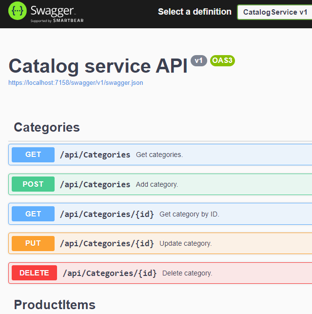

# Catalog Service

## Functional Requirements:
1.The following actions are supported:
	oList of categories
	oList of Items (filtration by category id and pagination)
	oAdd category
	oAdd item
	oUpdate category
	oUpdate item
	oDelete Item
	oDelete category (with the related items)

##Non-functional Requirements:
1.Testability
2.All endpoints should correspond to the 2nd level of the maturity model.

It has swagger for testing.
